# SWEA Fetch

SWEA(SW Expert Academy) **문제 번호 하나**로 샘플 입력·출력과 풀이 뼈대를 내 풀이 폴더에 만들어 주고, 풀이를 돌려 정답과 비교해 주는 Windows 도구.

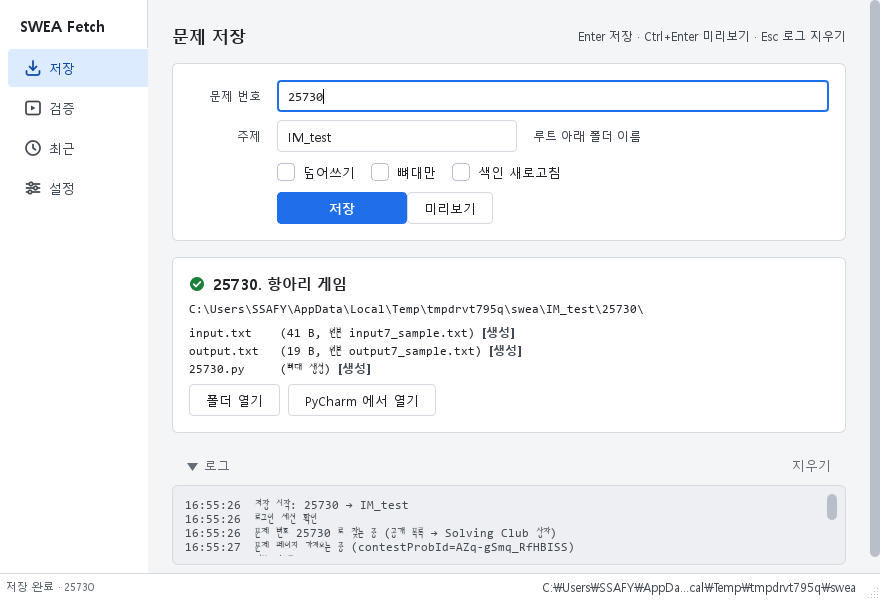

**하는 일**
- 문제 번호(예: `25730`) + 주제 폴더 → `swea\{주제}\{번호}\` 에 `input.txt`, `output.txt`, `{번호}.py` 뼈대 생성
- `{번호}.py` 를 `input.txt` 로 실행해 `output.txt` 와 줄 단위로 비교 (검증)
- 로그인·세션·문제 찾기를 알아서 처리. 비밀번호는 Windows 자격 증명 관리자에만 저장
- 검증이 끝나면 버튼 하나로 그 문제 폴더만 **git 커밋 + 푸시** (루트가 git 저장소일 때, 옵트인)

**하지 않는 일**
- 코드 제출 (SWEA 사이트에서 직접)
- 루트 폴더를 git 저장소로 만들어 주거나 GitHub 인증을 대신하기 (한 번은 직접 → [GitHub 연동](#github-연동))
- Python 외 언어의 뼈대·실행
- Contest 진행 중인 문제, 가입하지 않은 Solving Club 의 문제를 번호로 찾기 (→ [번호로 못 찾는 문제](#번호로-못-찾는-문제))

---

## 5분 시작 (exe)

Python 이 없어도 됩니다.

1. **다운로드**: [Releases](https://github.com/yoon7270/swea_fetcher/releases/latest) 에서 `swea-fetch-gui.exe` 를 받아 아무 폴더에 둡니다 (바탕화면 바로 가기 권장).
2. **백신 경고가 뜨면**: PyInstaller 로 만든 단일 exe 라 오탐이 있습니다. 같은 페이지의 `.sha256` 과 해시가 같으면 정상 파일입니다 → 백신 예외 추가. 자세히: [docs/troubleshooting.md](docs/troubleshooting.md#백신이-exe-를-차단할-때)
3. **첫 실행 → 설정 화면**이 자동으로 열립니다.

   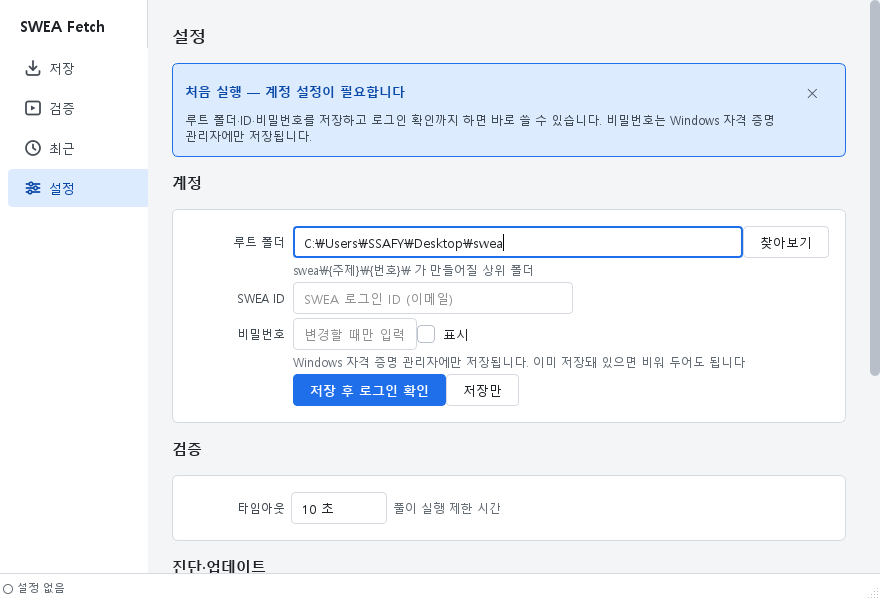

   | 항목 | 넣을 것 |
   |---|---|
   | 루트 폴더 | 풀이를 모아 두는 폴더 (예: `C:\Users\you\Desktop\swea`). 이 아래에 `{주제}\{번호}\` 가 만들어집니다 |
   | SWEA ID | SWEA 로그인 ID (이메일) |
   | 비밀번호 | Windows 자격 증명 관리자에만 저장됩니다. 화면에 표시되지 않고, 파일에도 남지 않습니다 |

   **[저장 후 로그인 확인]** → 상태바에 `● 로그인됨` 이 보이면 끝.

   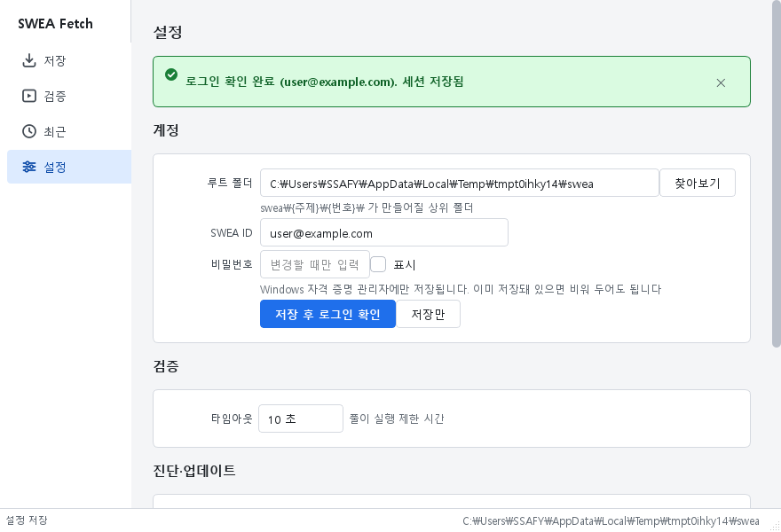

4. **저장** 페이지에서 문제 번호와 주제를 넣고 **[저장]** (또는 Enter).

   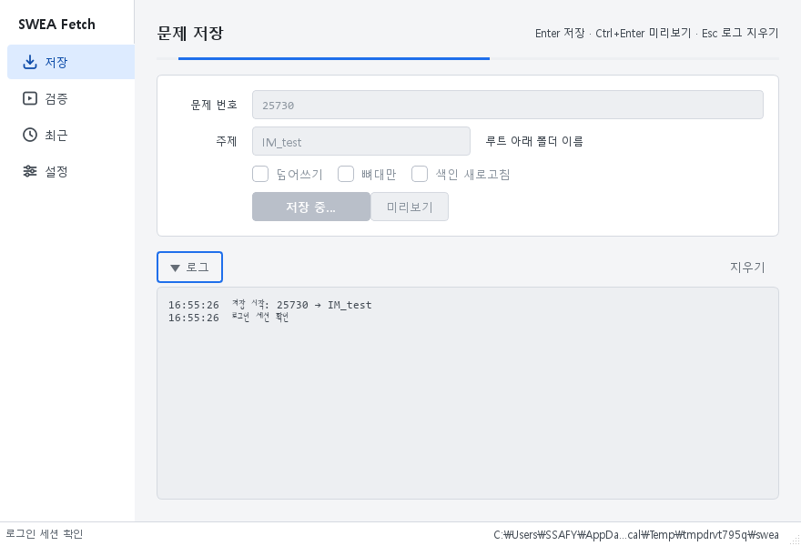

5. 결과 카드의 **[폴더 열기]** 로 확인. `{번호}.py` 를 열어 풀이를 시작하면 됩니다.

   

---

## 5분 시작 (소스/CLI)

Python 3.11 이상이 있고 명령줄을 선호하는 경우. PowerShell 기준, 한 블록에 한 명령.

Python 확인:

```powershell
py -3 --version
```

받기:

```powershell
git clone https://github.com/yoon7270/swea_fetcher.git
```

```powershell
cd swea_fetcher
```

가상환경 (권장):

```powershell
python -m venv .venv
```

```powershell
.\.venv\Scripts\Activate.ps1
```

설치 (GUI 까지 쓰려면 `[gui]` 포함):

```powershell
pip install -e ".[gui]"
```

계정 설정 (루트 폴더·ID·비밀번호를 물어봅니다. 비밀번호는 화면에 표시되지 않습니다):

```powershell
swea-fetch init
```

첫 저장:

```powershell
swea-fetch 25730 IM_test
```

```
[OK] 25730. 항아리 게임 → C:\Users\you\Desktop\swea\IM_test\25730
     input.txt   (1.2 KB, 원본 input7_sample.txt)
     output.txt  (0.3 KB, 원본 output7_sample.txt)
     25730.py    (뼈대 생성)
```

GUI 는 `swea-fetch-gui` 로 실행합니다. CLI 와 같은 설정(`%USERPROFILE%\.swea-fetch\`)을 씁니다.

---

## 폴더 규칙

```
{루트}\
├── BFS\
│   └── 1234\
│       ├── 1234.py        ← 뼈대 (이미 있으면 절대 덮어쓰지 않음)
│       ├── input.txt      ← 첨부 input*_sample.txt (UTF-8, LF 로 정규화)
│       └── output.txt     ← 첨부 output*_sample.txt
└── test\
    └── IM_test\           ← 주제는 test/IM_test 처럼 중첩 가능 (깊이 4까지)
        └── 25730\
```

- 주제는 `BFS`, `Queue`, `IM_test` 같은 폴더 이름. **`test/IM_test` 처럼 `/` 로 중첩**할 수 있습니다 (`\` 도 됨). 숫자만으로 된 주제(`2024`)는 문제 폴더와 구분이 안 되므로 거부합니다.
- 대소문자만 다른 폴더가 이미 있으면 (`bfs` ↔ `BFS`) 기존 이름을 씁니다. 비슷한 이름이 있으면 알려만 주고 진행합니다.

뼈대 코드:

```python
# 25730. 항아리 게임
import sys
sys.stdin = open("input.txt", "r")
T = int(input())
for test_case in range(1, T + 1):
    pass
```

---

## 기능

### 저장

문제 번호 + 주제 → 3개 파일. 번호는 문제 화면 상단 `25730. [07] 항아리 게임` 의 그 숫자입니다. 도구가 로컬 캐시 → 공개 Problem 목록 → User Problem → 가입한 Solving Club 문제 상자 순으로 찾습니다 (1~3초, 한 번 찾으면 캐시).

체크박스: **덮어쓰기** (`input.txt`/`output.txt` 만, `.py` 는 보호) · **뼈대만** (첨부 없는 문제용, 빈 `input.txt`) · **색인 새로고침** (새 문제 상자가 안 보일 때).

```powershell
swea-fetch 25730 IM_test
```

```powershell
swea-fetch 25730 test/IM_test --force
```

### 미리보기

저장하지 않고 무엇을 어디에 쓸지만 봅니다 (Ctrl+Enter / [미리보기]). 이미 있는 파일이 있으면 덮어쓰기가 필요한지 알려 줍니다.

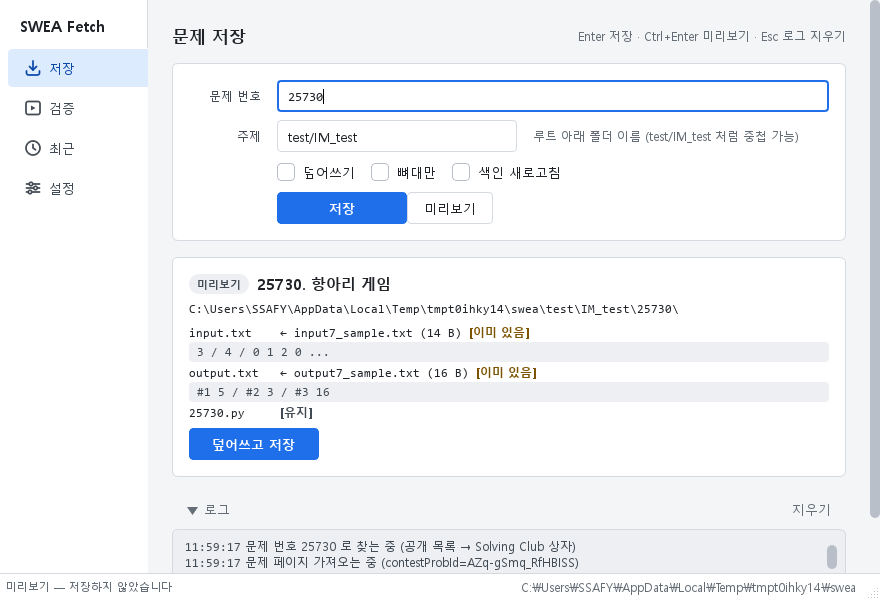

```powershell
swea-fetch 25730 IM_test --dry-run
```

### 뼈대만

샘플 첨부가 없는 문제. 폴더 + `{번호}.py` + 빈 `input.txt` 만 만듭니다.

```powershell
swea-fetch 25730 IM_test --skeleton-only
```

### 검증

`{번호}.py` 를 `input.txt` 로 실행해 `output.txt` 와 줄 단위로 비교합니다. 주제·번호를 고르거나 `.py` 파일(또는 문제 폴더)을 창에 끌어다 놓고 **[실행]**. 실행 중에는 **[취소]** 로 중단. 타임아웃(기본 10초)은 설정에서.

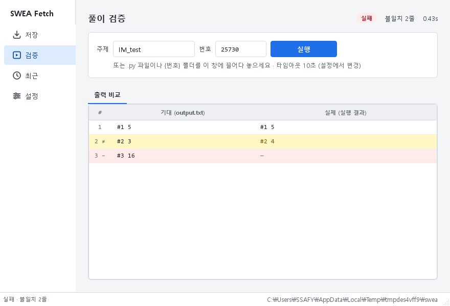

다른 줄은 `≠`, 빠진 줄은 `−`, 남는 줄은 `+`. 행을 선택하고 Ctrl+C 하면 내 출력이 복사됩니다.

```powershell
swea-fetch check IM_test 25730
```

실패하면 종료 코드 6. 제한 시간은 `--timeout 30`.

실행이 끝나면 오른쪽 위에 **[커밋 + 푸시]** 가 나타납니다 → [GitHub 연동](#github-연동).

### 최근

저장한 문제를 최근 순으로. 더블클릭 → 검증, 우클릭 → 폴더 열기 / 커밋 + 푸시.

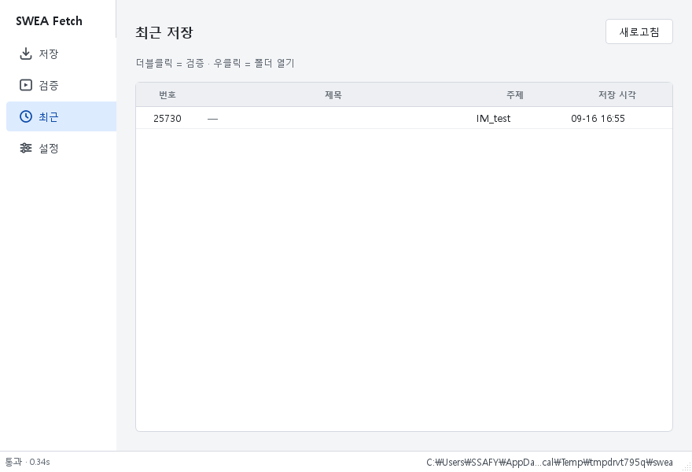

### 설정

루트·ID·비밀번호, 검증 타임아웃, GitHub 연동(커밋 메시지·자동 푸시), **[진단 정보 복사]**, 새 버전 알림, 세션/계정 삭제.

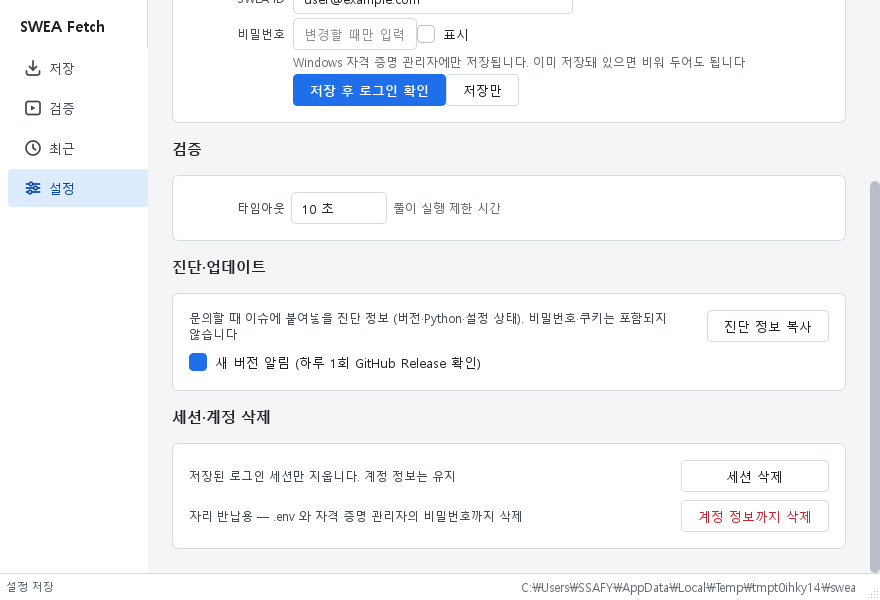

---

## 번호로 못 찾는 문제

Contest 진행 중인 문제나 **가입하지 않은** Solving Club 의 문제는 번호 검색 범위 밖입니다. 이때는 문제 페이지에서 값을 하나 복사해 **문제 번호 칸에 대신** 넣으세요 (CLI 도 같은 자리).

| 넣을 수 있는 값 | 어디서 복사하나 | 예 |
|---|---|---|
| 첨부파일 링크 | 문제 페이지 맨 아래 **입력 샘플 첨부(`input*_sample.txt`)** 를 우클릭 → *링크 주소 복사* | `https://swexpertacademy.com/main/common/contestProb/contestProbDown.do?downType=in&contestProbId=AZq-gSmq_RfHBISS` |
| 문제 상세 URL | 문제 목록에서 문제 제목을 클릭했을 때의 주소창 (`problemDetail.do?contestProbId=…`) | `https://swexpertacademy.com/main/code/problem/problemDetail.do?contestProbId=AZq-gSmq_RfHBISS` |
| `contestProbId` | 위 두 URL 의 `contestProbId=` 뒤 16자 | `AZq-gSmq_RfHBISS` |

문제를 **푸는 화면**의 주소창(`…/solvingProblem.do`)에는 ID 가 없어 쓸 수 없습니다. 페이지에서 번호를 못 읽는 경우엔 CLI 에서 `--num 25730` 으로 번호를 직접 줄 수 있습니다.

---

## GitHub 연동

검증이 끝난 문제 폴더(`{주제}/{번호}/`)**만** 커밋하고 푸시합니다. 도구는 git 명령을 대신 실행할 뿐입니다 — 토큰을 저장하거나 묻지 않고, force push 와 pull 도 하지 않습니다.

**전제 (한 번만)**
1. 루트 폴더가 git 저장소이고 `origin` 이 있어야 합니다. 도구는 저장소를 만들어 주지 않습니다.
2. GitHub 인증은 [Git for Windows](https://git-scm.com/download/win) 에 포함된 **Git Credential Manager** 가 맡습니다. 첫 푸시 때 브라우저 로그인 창이 한 번 뜹니다.

처음 설정하는 사람 (GitHub 에서 빈 저장소를 먼저 만든 뒤, 루트 폴더에서):

```powershell
git init -b main
```

```powershell
git remote add origin https://github.com/<계정>/<저장소>.git
```

```powershell
git add . ; git commit -m "init"
```

```powershell
git push -u origin main
```

이미 저장소로 쓰고 있다면 아무것도 할 게 없습니다. 설정 페이지 **GitHub 연동** 에 `main → origin/main` 처럼 보이면 준비 끝.

**버튼 (기본)** — 검증 페이지에서 실행이 끝나면 **[커밋 + 푸시]** 가 나타납니다 (통과면 파란 버튼, 실패해도 누를 수 있음). 매번 확인 창에서 커밋 메시지를 고치고 [커밋만] / [커밋 + 푸시] 를 고릅니다.

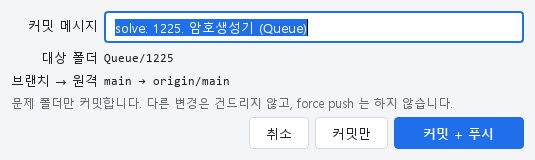

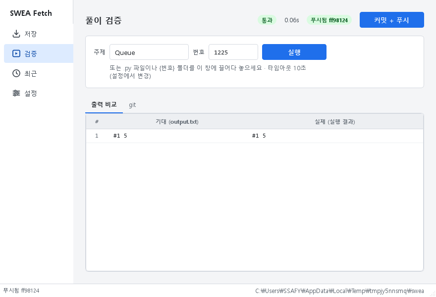

**자동 모드 (옵트인)** — 설정 페이지 **"검증 통과 시 자동으로 커밋 + 푸시"** 를 켜면 통과할 때마다 확인 없이 올라갑니다. 켤 때 경고가 한 번 뜹니다: *샘플 통과가 정답을 뜻하진 않습니다. 미완성 코드가 공개 저장소에 올라갈 수 있습니다.* 잘못 올렸으면 [되돌리기](docs/troubleshooting.md#자동-푸시를-되돌리려면).

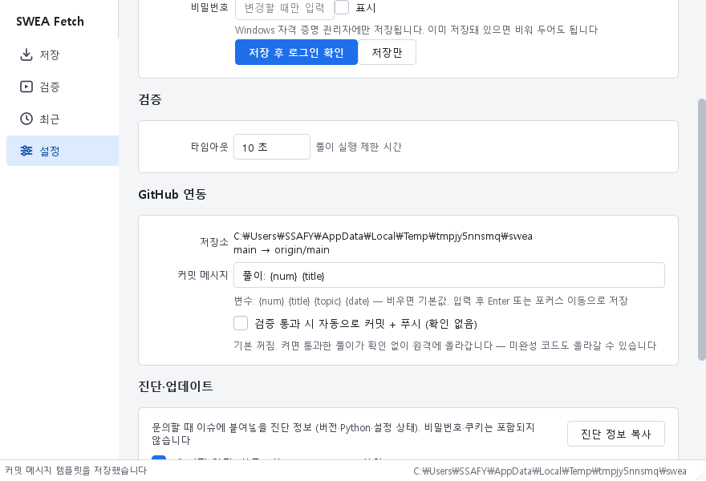

커밋 메시지 템플릿은 기본 `solve: {num}. {title} ({topic})` — 변수 `{num}` `{title}` `{topic}` `{date}`.

CLI:

```powershell
swea-fetch check IM_test 25730 --push
```

```powershell
swea-fetch push IM_test 25730 -m "solve: 25730"
```

`check --push` 는 **통과했을 때만** 푸시합니다. `push --no-push` 는 커밋만. 실패는 종료 코드 7 → [문제 해결](docs/troubleshooting.md#git-커밋--푸시-종료-코드-7).

**공용 PC 주의** — Git Credential Manager 의 GitHub 로그인은 Windows 자격 증명 관리자에 남습니다 (`git:https://github.com` 항목). 자리를 떠날 때 `swea-fetch logout --all` 과 함께 그 항목도 지우세요 → [보안과 계정](#보안과-계정).

---

## 보안과 계정

- 비밀번호는 **Windows 자격 증명 관리자**(제어판 → 자격 증명 관리자 → Windows 자격 증명 → `swea-fetch`)에만 저장됩니다. `%USERPROFILE%\.swea-fetch\.env` 에는 루트 경로와 ID 만 있고, 프로젝트 폴더 밖이라 git 에 올라가지 않습니다.
- **같은 Windows 계정을 공유하는 PC 에서는 보호되지 않습니다.** 자격 증명 관리자는 같은 Windows 사용자로 로그인한 누구나 읽을 수 있습니다. 공용 PC 에서는 쓰고 나면 반드시 지우세요 — 설정 페이지 **[계정 정보까지 삭제]** 또는:

```powershell
swea-fetch logout --all
```

- SWEA 는 **로그인 5회 연속 실패 시 계정을 잠급니다.** 도구는 한 실행에 1회, 누적 3회에서 스스로 멈추고 안내합니다. 잠금 후에는 브라우저에서 로그인이 되는지 확인하고 설정 페이지 [세션 삭제] (또는 `login_state.json` 삭제) 후 다시 시도하세요.
- 로그인 세션은 `session.json` 에 캐시되어 매번 로그인하지 않습니다. `swea-fetch logout` (옵션 없이) 은 세션만 지웁니다.
- **공용 PC 자리 반납 체크리스트**: ① `swea-fetch logout --all` ② 풀이 저장소 `git status` 로 미푸시 커밋 없는지 확인 후 푸시 ③ 자격 증명 관리자 → Windows 자격 증명에서 `git:https://github.com` 항목 삭제 (GitHub 연동을 썼다면) ④ 브라우저에 저장된 SWEA/GitHub 로그인 삭제. 로컬 폴더는 원격에 있으니 지워도 됩니다.

---

## 문제 해결 / FAQ

오류 메시지 → 원인 → 조치 표, 종료 코드, 백신 오탐, 검증용 Python 지정(`SWEA_PYTHON`), 설정 파일 위치: **[docs/troubleshooting.md](docs/troubleshooting.md)**

이슈를 올릴 때는 **진단 정보**를 붙여 주세요 (비밀번호·쿠키·ID 는 포함되지 않습니다):

- exe: 설정 페이지 → [진단 정보 복사]
- 소스:

```powershell
swea-fetch doctor
```

---

## 업데이트

하루 1회 GitHub Release 를 확인해 새 버전이 있으면 알립니다 — GUI 는 상태바 오른쪽 배지(클릭 → Release 페이지), CLI 는 명령 끝에 `[알림] 새 버전 …` 한 줄.

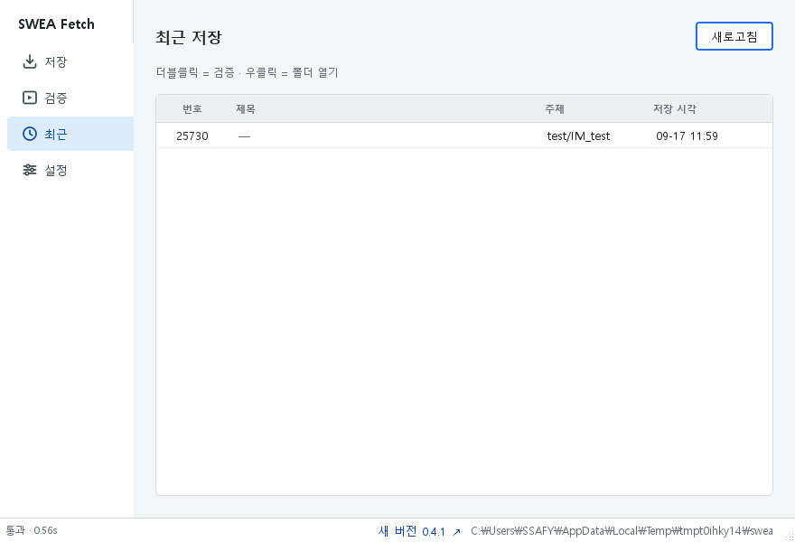

- exe: [Releases](https://github.com/yoon7270/swea_fetcher/releases/latest) 에서 새 exe 를 받아 **파일만 바꾸면** 됩니다. 설정·비밀번호·캐시는 그대로 유지됩니다.
- 소스: `git pull` 후 `pip install -e ".[gui]"`
- 끄기: 설정 페이지 체크박스 / `--no-update-check` / 환경변수 `SWEA_NO_UPDATE_CHECK=1`

변경 내역: [CHANGELOG.md](CHANGELOG.md)

---

## 문의·요청

**[GitHub Issues](https://github.com/yoon7270/swea_fetcher/issues/new/choose)** — *버그 신고* / *기능 요청* 템플릿 중 하나를 고르면 필요한 항목이 채워져 있습니다. 버그는 진단 정보와 재현 단계를, 요청은 "지금은 어떻게 하고 있는지"를 함께 적어 주세요.

---

<details>
<summary><b>개발자용</b> — 구조, 테스트, 사이트 구조 변경 대응, 빌드·Release</summary>

[docs/development.md](docs/development.md) 참고. 요약:

```powershell
pip install -e ".[dev,gui]"
```

```powershell
pytest
```

- 모듈 구조와 역할, 선택자 수정 위치(`swea_fetcher/parser.py` 상단 상수), 페이지 조사 기록([docs/swea-page-notes.md](docs/swea-page-notes.md))
- exe 빌드: `pyinstaller packaging\swea-fetch-gui.spec` → `dist\swea-fetch-gui.exe` (커밋하지 않음), 자가진단 `SWEA_FETCH_SELFTEST`
- 디자인 스펙 [design/design-spec.md](design/design-spec.md), 화면 캡처 [docs/gui-screenshots/](docs/gui-screenshots/)

</details>

## 라이선스

[MIT](LICENSE)
