# SWEA Fetch

SWEA(SW Expert Academy) **문제 번호 하나**로 샘플 입력·출력과 풀이 뼈대를 내 풀이 폴더에 만들어 주고, 풀이를 돌려 정답과 비교해 주는 Windows 도구.

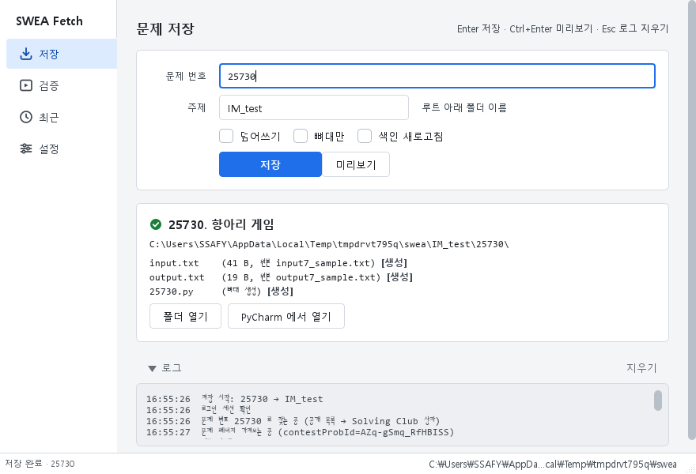

**하는 일**
- 문제 번호(예: `25730`) + 주제 폴더 → `swea\{주제}\{번호}\` 에 `input.txt`, `output.txt`, `{번호}.py` 뼈대 생성
- `{번호}.py` 를 `input.txt` 로 실행해 `output.txt` 와 줄 단위로 비교 (검증)
- 로그인·세션·문제 찾기를 알아서 처리. 비밀번호는 Windows 자격 증명 관리자에만 저장
- (선택) **AI 앱(Codex, Claude Code 등)에서 "1231번 DFS1 에 받아줘"** 로 저장 → [AI 앱에서 쓰기](#ai-앱에서-쓰기-mcp-선택)
- **SWEA 에 제출**해 채점 결과를 받고, **Pass 면 그 문제 폴더만 git 커밋 + 푸시** (루트가 git 저장소일 때, 옵트인)

**하지 않는 일**
- 채점 결과를 바꾸거나 제출 횟수 제한을 우회하기 (제출은 사이트에서 직접 하는 것과 똑같이 1회씩 셉니다)
- 루트 폴더를 git 저장소로 만들어 주거나 GitHub 인증을 대신하기 (한 번은 직접 → [GitHub 연동](#github-연동))
- Python 외 언어의 뼈대·실행
- Contest 진행 중인 문제, 가입하지 않은 Solving Club 의 문제를 번호로 찾기 (→ [번호로 못 찾는 문제](#번호로-못-찾는-문제))

---

## 5분 시작 (exe)

Python 이 없어도 됩니다.

1. **다운로드**: [Releases](https://github.com/yoon7270/swea_fetcher/releases/latest) 에서 `swea-fetch-gui.exe` 를 받아 아무 폴더에 둡니다 (바탕화면 바로 가기 권장).
2. **백신 경고가 뜨면**: PyInstaller 로 만든 단일 exe 라 오탐이 있습니다. 같은 페이지의 `.sha256` 과 해시가 같으면 정상 파일입니다 → 백신 예외 추가. 자세히: [docs/troubleshooting.md](docs/troubleshooting.md#백신이-exe-를-차단할-때)
3. **첫 실행 → 설정 화면**이 자동으로 열립니다.

   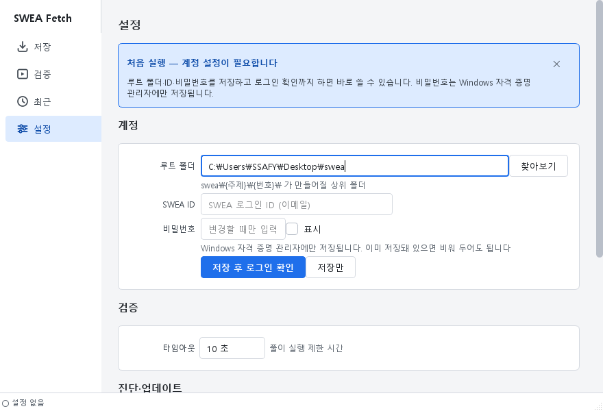

   | 항목 | 넣을 것 |
   |---|---|
   | 루트 폴더 | 풀이를 모아 두는 폴더 (예: `C:\Users\you\Desktop\swea`). 이 아래에 `{주제}\{번호}\` 가 만들어집니다 |
   | SWEA ID | SWEA 로그인 ID (이메일) |
   | 비밀번호 | Windows 자격 증명 관리자에만 저장됩니다. 화면에 표시되지 않고, 파일에도 남지 않습니다 |

   **[저장 후 로그인 확인]** → 상태바에 `● 로그인됨` 이 보이면 끝.

   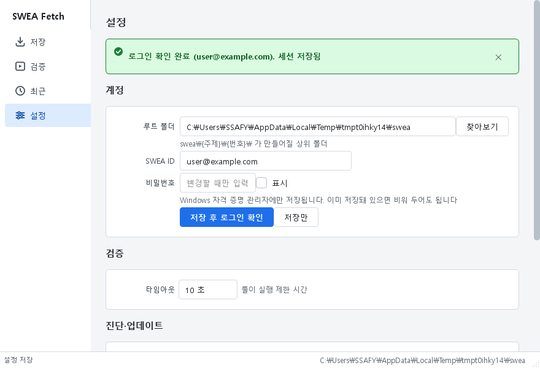

4. **저장** 페이지에서 문제 번호와 주제를 넣고 **[저장]** (또는 Enter).

   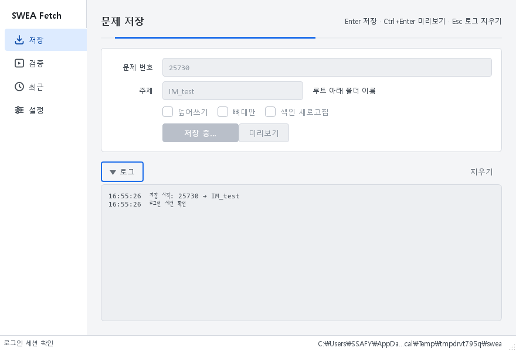

5. 결과 카드의 **[폴더 열기]** 로 확인. `{번호}.py` 를 열어 풀이를 시작하면 됩니다.

   

---

## 5분 시작 (소스/CLI)

Python 3.11 이상이 있고 명령줄을 선호하는 경우. PowerShell 기준, 한 블록에 한 명령.

Python 확인:

```powershell
py -3 --version
```

받기:

```powershell
git clone https://github.com/yoon7270/swea_fetcher.git
```

```powershell
cd swea_fetcher
```

가상환경 (권장):

```powershell
python -m venv .venv
```

```powershell
.\.venv\Scripts\Activate.ps1
```

설치 (GUI 까지 쓰려면 `[gui]` 포함):

```powershell
pip install -e ".[gui]"
```

계정 설정 (루트 폴더·ID·비밀번호를 물어봅니다. 비밀번호는 화면에 표시되지 않습니다):

```powershell
swea-fetch init
```

첫 저장:

```powershell
swea-fetch 25730 IM_test
```

```
[OK] 25730. 항아리 게임 → C:\Users\you\Desktop\swea\IM_test\25730
     input.txt   (1.2 KB, 원본 input7_sample.txt)
     output.txt  (0.3 KB, 원본 output7_sample.txt)
     25730.py    (뼈대 생성)
```

GUI 는 `swea-fetch-gui` 로 실행합니다. CLI 와 같은 설정(`%USERPROFILE%\.swea-fetch\`)을 씁니다.

---

## 폴더 규칙

```
{루트}\
├── BFS\
│   └── 1234\
│       ├── 1234.py        ← 뼈대 (이미 있으면 절대 덮어쓰지 않음)
│       ├── input.txt      ← 첨부 input*_sample.txt (UTF-8, LF 로 정규화)
│       └── output.txt     ← 첨부 output*_sample.txt
└── test\
    └── IM_test\           ← 주제는 test/IM_test 처럼 중첩 가능 (깊이 4까지)
        └── 25730\
```

- 주제는 `BFS`, `Queue`, `IM_test` 같은 폴더 이름. **`test/IM_test` 처럼 `/` 로 중첩**할 수 있습니다 (`\` 도 됨). 숫자만으로 된 주제(`2024`)는 문제 폴더와 구분이 안 되므로 거부합니다.
- 대소문자만 다른 폴더가 이미 있으면 (`bfs` ↔ `BFS`) 기존 이름을 씁니다. 비슷한 이름이 있으면 알려만 주고 진행합니다.

뼈대 코드:

```python
# 25730. 항아리 게임
import sys
sys.stdin = open("input.txt", "r")
T = int(input())
for test_case in range(1, T + 1):
    pass
```

---

## 기능

### 저장

문제 번호 + 주제 → 3개 파일. 번호는 문제 화면 상단 `25730. [07] 항아리 게임` 의 그 숫자입니다. 도구가 로컬 캐시 → 공개 Problem 목록 → User Problem → 가입한 Solving Club 문제 상자 순으로 찾습니다 (1~3초, 한 번 찾으면 캐시).

체크박스: **덮어쓰기** (`input.txt`/`output.txt` 만, `.py` 는 보호) · **뼈대만** (첨부 없는 문제용, 빈 `input.txt`) · **색인 새로고침** (새 문제 상자가 안 보일 때).

```powershell
swea-fetch 25730 IM_test
```

```powershell
swea-fetch 25730 test/IM_test --force
```

### 미리보기

저장하지 않고 무엇을 어디에 쓸지만 봅니다 (Ctrl+Enter / [미리보기]). 이미 있는 파일이 있으면 덮어쓰기가 필요한지 알려 줍니다.

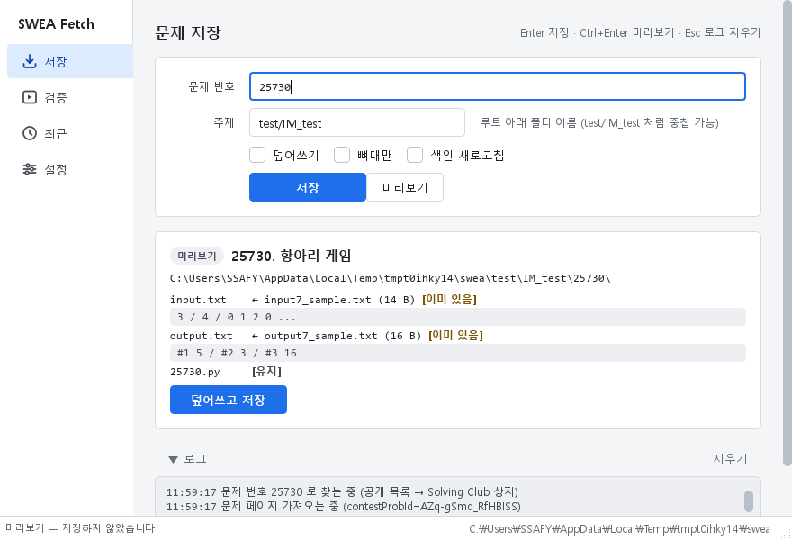

```powershell
swea-fetch 25730 IM_test --dry-run
```

### 뼈대만

샘플 첨부가 없는 문제. 폴더 + `{번호}.py` + 빈 `input.txt` 만 만듭니다.

```powershell
swea-fetch 25730 IM_test --skeleton-only
```

### 검증

`{번호}.py` 를 `input.txt` 로 실행해 `output.txt` 와 줄 단위로 비교합니다. 주제·번호를 고르거나 `.py` 파일(또는 문제 폴더)을 창에 끌어다 놓고 **[실행]**. 실행 중에는 **[취소]** 로 중단. 타임아웃(기본 10초)은 설정에서.

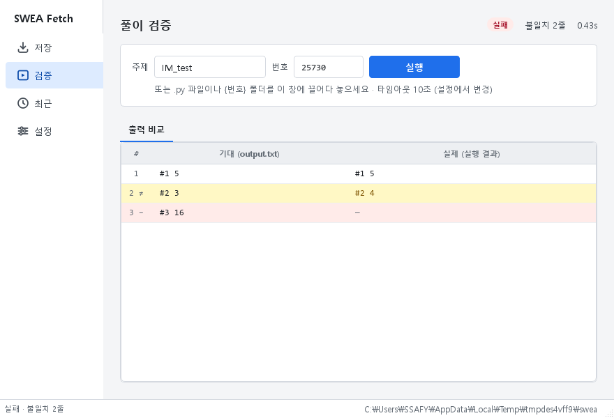

다른 줄은 `≠`, 빠진 줄은 `−`, 남는 줄은 `+`. 행을 선택하고 Ctrl+C 하면 내 출력이 복사됩니다.

```powershell
swea-fetch check IM_test 25730
```

실패하면 종료 코드 6. 제한 시간은 `--timeout 30`.

로컬 검증은 샘플 입출력만 봅니다. 실제 채점은 **[SWEA 제출]** → [SWEA 제출과 GitHub 연동](#github-연동).

### 최근

저장한 문제를 최근 순으로. 클릭 → 문제 탭에 지문 표시 (다시 저장·덮어쓰기 없이 지문만 가져옴), 우클릭 → 에디터·폴더 열기 / 검증 / 커밋 + 푸시.

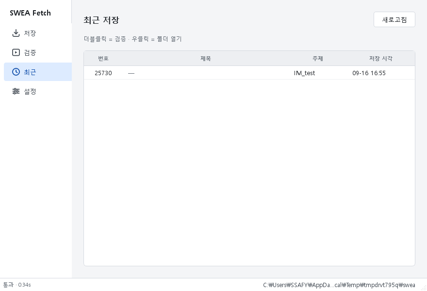

### 설정

루트·ID·비밀번호, 검증 타임아웃, GitHub 연동(커밋 메시지·자동 푸시), **[진단 정보 복사]**, 새 버전 알림, 세션/계정 삭제, **화면 테마 색**(6종, 고르면 바로 적용).

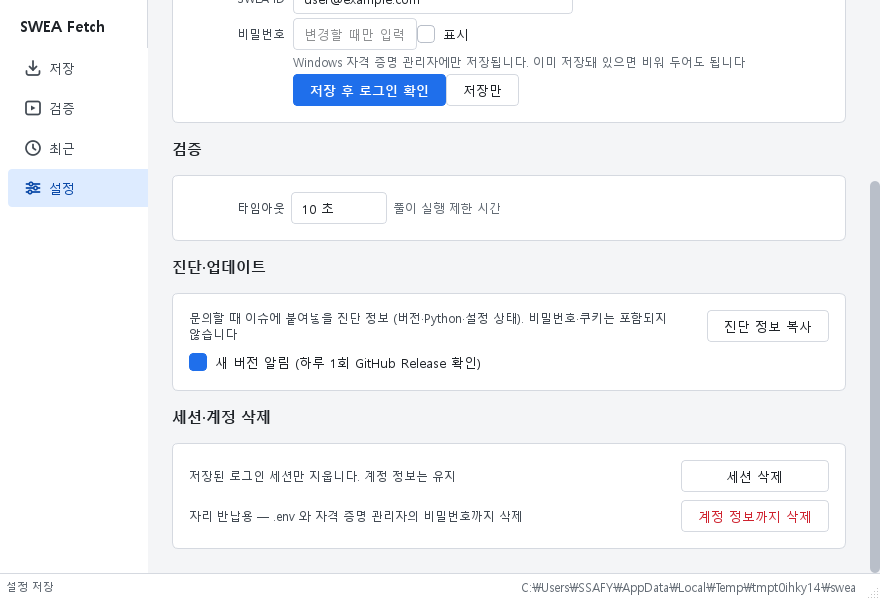

### AI 코치 (GUI, 선택)

제출 결과를 받은 직후 AI 의 도움을 받습니다. 이 PC 에 설치된 **Codex CLI**(우선) 또는 **Claude Code CLI** 를 호출하므로 API 키가 필요 없고 각자 구독을 씁니다. 두 CLI 모두 없으면 이 기능만 꺼져 있습니다 (설정 → AI 코치 → [연결 테스트]).

| 상황 | 버튼 | 내용 |
|---|---|---|
| SWEA Pass | **코드 평가 받기** | 시간·공간 복잡도, 가독성, 개선점 |
| 오답·시간초과·런타임 에러 (로컬 검증 실패 포함) | **힌트** (전구) | 방향 → 위치 → 수정 방향 3단계, 정답 코드는 보여주지 않음 |
| 같은 문제 오답이 기준(기본 3회) 이상 | **정답 풀이 보기** | 설명 + 코드를 **화면에만** 표시 (`{번호}.py` 는 그대로), 본 뒤 기본 3일 뒤 복습 알림 |

- **전송**: 버튼을 누를 때 1건씩만 보냅니다 (문제 번호·제목·지문 텍스트, 샘플 입출력 앞부분, 풀이 코드, 채점 요약). SWEA 아이디·비밀번호·세션·폴더 경로·그림은 보내지 않습니다. 엔진(Codex / Claude Code)별로 **처음 한 번 동의**를 받고, 설정에서 초기화할 수 있습니다. 지문은 SWEA 의 저작물이므로 개인 학습 용도로만 쓰세요
- **공용 PC 주의**: Codex/Claude CLI 는 자체 세션 기록을 홈 폴더에 남길 수 있습니다 (앱이 지우지 않음). 앱의 AI 기록(`~/.swea-fetch/coach/`)은 `swea-fetch logout --all` 또는 설정의 [AI 기록 지우기] 로 지워집니다. 환경변수 `OPENAI_API_KEY`/`ANTHROPIC_API_KEY` 가 있으면 CLI 가 구독 대신 API 과금으로 동작할 수 있어 설정 화면에 경고만 표시합니다
- **집계 범위**: 오답 횟수는 이 앱(GUI/CLI)으로 제출한 채점 결과만 셉니다 (SWEA 서버 기록과 다를 수 있음). 컴파일 거부·횟수 소진 같은 제출 불가는 세지 않습니다
- 설치: Codex CLI 는 `npm install -g @openai/codex` 후 `codex login`, Claude Code CLI 는 `npm install -g @anthropic-ai/claude-code` 후 `claude` 를 한 번 실행해 로그인 (공식 안내 기준으로 확인하세요). **설치한 뒤에는 앱을 다시 켜야** 합니다
- **GPT & Claude 동시 답변 (선택)**: 설정 → AI 코치 → 엔진을 `GPT & Claude (둘 다)` 로 고르면 같은 요청을 Codex 와 Claude Code 에 **동시에** 보내 답 2개를 나란히 보여줍니다 (기본은 `자동`이라 한 곳에만 보냅니다). **요청 1건마다 GPT 와 Claude 에 각각 1번씩 요청하고 지문·코드가 두 곳으로 전송됩니다** (각 서비스에서 쓰는 양은 한 곳만 쓸 때와 같습니다) — 동의 창에 두 엔진이 함께 표시됩니다. 한쪽이 실패해도 다른 쪽 답은 그대로 보이고 패널별 [다시 받기] 로 그 엔진만 다시 요청할 수 있습니다. 한쪽 CLI 만 설치돼 있으면 설치된 쪽만 실행합니다
- 설정 `.env`: `SWEA_AI_ENGINE=auto|codex|claude|both`, `SWEA_AI_WRONG_THRESHOLD=3` (1~20), `SWEA_REVIEW_DAYS=3` (1~30) — 설정 페이지에서도 바꿉니다

### 성장 기록 (GUI, 선택)

AI 코치를 쓸수록 **어떤 방향이 좋아지고 있는지** 매주 정리해 주는 **성장 탭**입니다 (내비 5번째, `Ctrl+5` — 설정은 `Ctrl+6` 으로 밀렸습니다). 추가 AI 요청 없이, 이미 받는 코치 응답 끝에 붙는 분류 태그(경계·예외 조건, 시간 복잡도, 재귀·DFS/BFS 같은 고정 12개)와 제출 결과(첫 시도 Pass 비율, Pass 전 평균 오답, 시간초과 비중 등)를 모읍니다.

- **주간 리포트**: 매주 월요일 00:00 기준으로 지난 주가 확정되면 앱을 켤 때(켜 둔 채면 30분 간격 확인) 리포트를 만들고 상태바에 "새 성장 리포트 ↗" 배지와 시작 메시지로 알립니다. 좋아진 점·지켜볼 점은 **정해진 규칙**(표본이 충분할 때만, 예: 첫 시도 Pass 비율 +15%p)으로 판정하고, AI 는 그 결과를 해설하는 3~5문장 코멘트만 씁니다. 태그는 AI 판단이라 정확한 진단이 아닌 **참고용**입니다
- **저장하는 것**: 문제 번호·주제 폴더명·시각·결과 종류·분류 태그·집계 숫자뿐입니다. **코드·지문·AI 응답 원문은 저장하지 않습니다** (풀이 잔디 기록에만 문제 제목이 들어갑니다). 위치는 `~/.swea-fetch/coach/profile/` 이며 루트 폴더·GitHub 로는 올라가지 않습니다
- **AI 로 보내는 것**: 주간 코멘트에는 **집계 숫자·분류 이름·판정 문장·기간만** 보냅니다 (코드·지문·문제 번호·제목·폴더명·아이디 제외). 해당 엔진에 코치 동의가 이미 있으면 자동으로, 없으면 성장 탭의 [동의하고 코멘트 받기] 를 누를 때 한 번 확인합니다 (앱 시작 시 창이 뜨지 않습니다). 엔진은 설정을 따르고 "둘 다" 여도 설치된 첫 엔진(Codex 우선) 1개만 씁니다. 이벤트가 3건 미만인 주는 AI 를 부르지 않습니다
- **팁**: 같은 약점이 최근 코치 응답 3번 연속 지적되면 AI 코치 탭 아래에 고정 문구 한 줄이 한 번 뜹니다 (같은 항목은 7일간 다시 뜨지 않음)
- **풀이 잔디**: 성장 탭 맨 위에 GitHub 처럼 **최근 1년, 하루에 Pass 한 문제 수**를 칸으로 채웁니다 (일요일 시작, 1 / 2 / 3 / 4+ 문제로 4단계 농도). Pass 는 **앱으로 낸 SWEA 제출 Pass + 로컬 검증 통과**(샘플 출력 일치, CLI `check` 포함)이고 같은 날 같은 문제는 1번입니다. 칸에 마우스를 올리면 날짜·문제 수, 클릭하면 그날 푼 문제 목록이 뜨고 항목을 누르면 문제 탭에서 지문을 봅니다. 색은 설정 → 성장 기록에서 고릅니다 (기본 초록). 처음 열 때 기존 기록(최근 120일의 SWEA Pass, AI 코치 기록의 마지막 Pass)으로 채우며, **로컬 검증의 과거 기록은 남아 있지 않아 채울 수 없습니다.** `coach/profile/solved.json`(번호·주제·제목·방식·시각, 400일 보관)에만 저장되고 코드는 저장하지 않습니다
- **끄기·삭제**: 설정 → 성장 기록에서 기록 전체 / 주간 AI 코멘트 자동 생성을 끄고 [성장 기록 지우기] 로 `coach/profile`(풀이 잔디 포함)만 지울 수 있습니다. 끄면 풀이 잔디도 기록·표시하지 않습니다. `swea-fetch logout --all` 과 [AI 기록 지우기] 는 성장 기록까지 지웁니다. `.env`: `SWEA_GROWTH=1|0`, `SWEA_GROWTH_COMMENT=1|0`

---

## 번호로 못 찾는 문제

Contest 진행 중인 문제나 **가입하지 않은** Solving Club 의 문제는 번호 검색 범위 밖입니다. 이때는 문제 페이지에서 값을 하나 복사해 **문제 번호 칸에 대신** 넣으세요 (CLI 도 같은 자리).

| 넣을 수 있는 값 | 어디서 복사하나 | 예 |
|---|---|---|
| 첨부파일 링크 | 문제 페이지 맨 아래 **입력 샘플 첨부(`input*_sample.txt`)** 를 우클릭 → *링크 주소 복사* | `https://swexpertacademy.com/main/common/contestProb/contestProbDown.do?downType=in&contestProbId=AZq-gSmq_RfHBISS` |
| 문제 상세 URL | 문제 목록에서 문제 제목을 클릭했을 때의 주소창 (`problemDetail.do?contestProbId=…`) | `https://swexpertacademy.com/main/code/problem/problemDetail.do?contestProbId=AZq-gSmq_RfHBISS` |
| `contestProbId` | 위 두 URL 의 `contestProbId=` 뒤 16자 | `AZq-gSmq_RfHBISS` |

문제를 **푸는 화면**의 주소창(`…/solvingProblem.do`)에는 ID 가 없어 쓸 수 없습니다. 페이지에서 번호를 못 읽는 경우엔 CLI 에서 `--num 25730` 으로 번호를 직접 줄 수 있습니다.

---

## GitHub 연동

흐름: 검증 페이지 **[SWEA 제출]** → SWEA 가 채점 → **Pass** 면 그 문제 폴더(`{주제}/{번호}/`)**만** 커밋하고 푸시. 오답이면 푸시하지 않습니다. 도구는 git 명령을 대신 실행할 뿐입니다 — 토큰을 저장하거나 묻지 않고, force push 와 pull 도 하지 않습니다.

**제출 규칙 (SWEA 쪽 제약)**
- 제출은 사이트에서 직접 누르는 것과 같이 **문제당 제출 횟수를 1회 소모**합니다. 그래서 매번 확인 창이 뜹니다.
- SWEA 는 Python 코드의 `import sys` 를 거부합니다. 도구가 뼈대의 `import sys` / `sys.stdin = open(...)` 줄을 **빼고** 보내며, 그 밖에 `sys.` 를 쓴 코드(`sys.stdin.readline`, `setrecursionlimit`)는 제출하지 않고 안내합니다.
- 채점 결과는 제출 응답에 바로 옵니다 (보통 수 초). 결과 배지 `Pass` / `오답: 10개 중 7개` 등.
- 같은 번호가 여러 모의/클럽 상자에 있으면 **최신 상자**로 제출합니다. 확인창의 **[다시 찾기]** (CLI `submit --refresh-index`) 로 대상을 다시 찾을 수 있습니다.

**전제 (한 번만)**
1. 루트 폴더가 git 저장소이고 `origin` 이 있어야 합니다. 도구는 저장소를 만들어 주지 않습니다.
2. GitHub 인증은 [Git for Windows](https://git-scm.com/download/win) 에 포함된 **Git Credential Manager** 가 맡습니다. 첫 푸시 때 브라우저 로그인 창이 한 번 뜹니다.

처음 설정하는 사람 (GitHub 에서 빈 저장소를 먼저 만든 뒤, 루트 폴더에서):

```powershell
git init -b main
```

```powershell
git remote add origin https://github.com/<계정>/<저장소>.git
```

```powershell
git add . ; git commit -m "init"
```

```powershell
git push -u origin main
```

이미 저장소로 쓰고 있다면 아무것도 할 게 없습니다. 설정 페이지 **GitHub 연동** 에 `main → origin/main` 처럼 보이면 준비 끝.

**버튼 (기본)** — 검증 페이지 **[SWEA 제출]** → 확인 → 채점. Pass 면 배너의 **[커밋 + 푸시]** 를 누릅니다 (확인 창에서 메시지 편집, [커밋만] / [커밋 + 푸시]). 로컬 검증만 한 뒤에도 오른쪽 위 [커밋 + 푸시] 로 수동 푸시는 가능합니다.

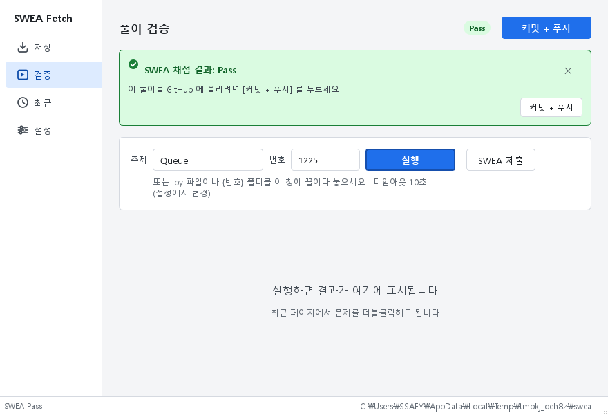

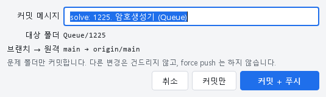

### 자동 동기화 (옵트인)

설정 페이지 **"GitHub 자동 동기화 켜기"** → **범위** 와 **시점** 을 고르면 버튼 없이 알아서 커밋+푸시됩니다. 켤 때 경고가 한 번 뜨고, 로컬 검증 통과만으로는(그 시점을 안 골랐으면) 올라가지 않습니다.

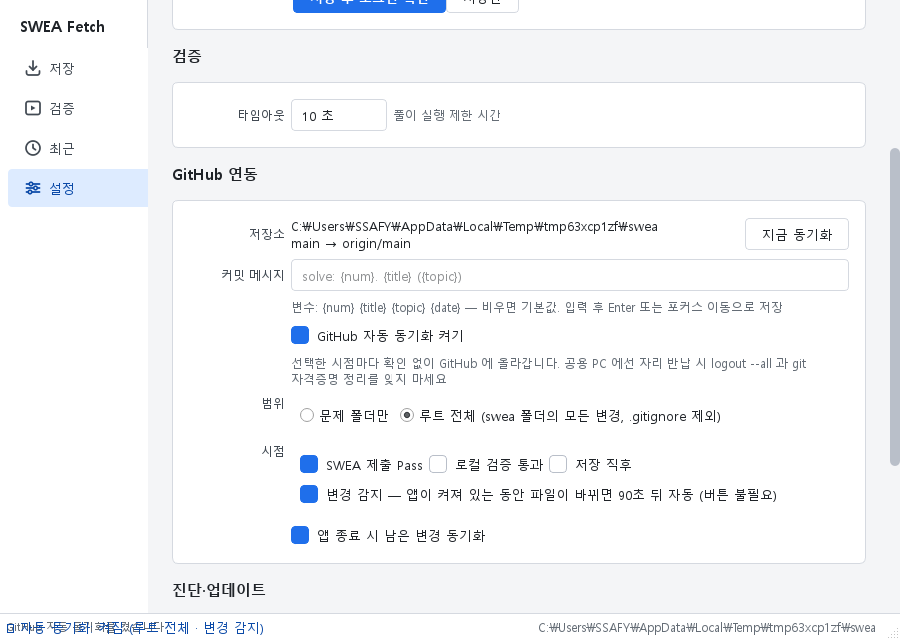

**범위**

| 값 | 올라가는 것 |
|---|---|
| 문제 폴더만 (기본) | 변경된 `{주제}/{번호}/` 폴더들만. 루트의 다른 파일은 안 건드림 |
| 루트 전체 | swea 폴더의 모든 변경 (`.gitignore` 제외). 풀이 외 파일도 포함되니 주의 — 처음 고르면 올라갈 파일 수·예시를 확인창으로 보여줍니다 |

**시점** (여러 개 선택 가능)

| 값 | 언제 |
|---|---|
| SWEA 제출 Pass (기본) | [SWEA 제출] 결과가 Pass 일 때 |
| 로컬 검증 통과 | [실행] 이 통과할 때 |
| 저장 직후 | 문제를 저장한 직후 |
| **변경 감지** | **버튼 없이** — 앱이 켜져 있는 동안 파일이 바뀌면 90초 뒤 자동. 종료 시 남은 변경도 1회 동기화(옵션) |

> 버튼 없이 쓰려면 **변경 감지** 를 켜고 앱(exe / `swea-fetch-gui`)을 실행해 두세요. 백그라운드 서비스는 만들지 않으므로 앱이 꺼져 있으면 동기화되지 않습니다.

**루트 전체를 쓸 때** 는 `.gitignore` 로 잡파일을 빼두길 권장합니다:

```
.idea/
__pycache__/
*.pyc
```

상태바의 `⟳ 자동 동기화: 켜짐` 을 클릭하면 설정으로 갑니다. 반복 실패(충돌·인증)면 `⚠ 일시 중지` 로 바뀌고 도배하지 않습니다 → [문제 해결](docs/troubleshooting.md#자동-동기화가-일시-중지됐을-때). 잘못 올렸으면 [되돌리기](docs/troubleshooting.md#자동-푸시를-되돌리려면).

커밋 메시지 템플릿은 기본 `solve: {num}. {title} ({topic})` — 변수 `{num}` `{title}` `{topic}` `{date}` (단일 문제 커밋에만 적용; 여러 문제·루트 범위는 `solve: 1225, 1226` / `sync: 날짜`).

CLI:

```powershell
swea-fetch sync --scope root
```

```powershell
swea-fetch submit IM_test 25730 --push
```

```powershell
swea-fetch push IM_test 25730 -m "solve: 25730"
```

`submit` 은 확인 프롬프트 뒤 제출하고 결과를 출력합니다 (`-y` 로 생략). `--push` 는 **Pass 일 때만** 푸시. 오답은 종료 코드 8, git 실패는 7 → [문제 해결](docs/troubleshooting.md#swea-제출-종료-코드-8). `push --no-push` 는 커밋만. `swea-fetch sync [--scope problem|root] [--dry-run]` 는 자동 동기화를 수동 1회 실행(변경 감지는 GUI 전용 — 스케줄러로 `sync` 를 부르면 대체 가능). `fetch`/`check` 에 `--no-push` 로 이번만 해제.

**공용 PC 주의** — Git Credential Manager 의 GitHub 로그인은 Windows 자격 증명 관리자에 남습니다 (`git:https://github.com` 항목). 자리를 떠날 때 `swea-fetch logout --all` 과 함께 그 항목도 지우세요 → [보안과 계정](#보안과-계정).

---

## AI 앱에서 쓰기 (MCP, 선택)

Codex / Claude Code / Claude Desktop / Cursor 같은 AI 앱에서 "1231번 DFS1 에 받아줘" 로 저장할 수 있습니다. 표준 MCP(stdio) 서버라 MCP 를 지원하는 앱이면 어디서나 됩니다. **Python 이 있는 Windows 사용자용**이며, exe 버전에는 들어 있지 않습니다. 이 PC 에서만 동작하는 로컬 서버입니다 (별도 서버·비용 없음).

1. 전용 가상환경 만들기:

```powershell
py -3 -m venv $env:USERPROFILE\swea-fetch-venv
```

2. 설치 (git 필요):

```powershell
& $env:USERPROFILE\swea-fetch-venv\Scripts\pip install "swea-fetcher[mcp] @ git+https://github.com/yoon7270/swea_fetcher.git"
```

3. 계정 설정 — **터미널에서 직접 입력하세요. AI 채팅창에 비밀번호를 적지 마세요**:

```powershell
& $env:USERPROFILE\swea-fetch-venv\Scripts\swea-fetch init
```

4. AI 앱에 등록합니다. 실행 파일은 `C:/Users/<내이름>/swea-fetch-venv/Scripts/swea-fetch-mcp.exe` (설정 파일에서는 백슬래시 대신 `/` 를 쓰세요):
   - **Codex** (CLI · IDE 확장 · 앱 공통): `%USERPROFILE%\.codex\config.toml` 에 아래 블록을 추가하고 Codex 를 다시 시작합니다. 첫 번호 조회는 문제 색인을 만드느라 1분을 넘길 수 있어 `tool_timeout_sec` 을 늘려 둡니다 (기본 60초)

```toml
[mcp_servers.swea]
command = "C:/Users/<내이름>/swea-fetch-venv/Scripts/swea-fetch-mcp.exe"
args = []
startup_timeout_sec = 30
tool_timeout_sec = 180
```

   Codex 에서 `/mcp` 를 입력해 `swea` 와 도구 5개가 보이면 연결된 것입니다. (CLI 로 등록하려면 `codex mcp add swea -- C:/Users/<내이름>/swea-fetch-venv/Scripts/swea-fetch-mcp.exe` 후 위 두 timeout 줄만 config.toml 에 추가)

   - **Claude Code**:

```powershell
claude mcp add --scope user swea -- C:/Users/<내이름>/swea-fetch-venv/Scripts/swea-fetch-mcp.exe
```

   - **Claude Desktop**: 설정 → 개발자 → 구성 편집 (`claude_desktop_config.json`, 보통 `%APPDATA%\Claude\`) 에 아래를 넣고 저장한 뒤 앱을 완전히 종료했다가 다시 실행
   - **Cursor**: `%USERPROFILE%\.cursor\mcp.json` 에 같은 블록

```json
{
  "mcpServers": {
    "swea": {
      "command": "C:/Users/<내이름>/swea-fetch-venv/Scripts/swea-fetch-mcp.exe",
      "args": []
    }
  }
}
```

5. 사용 예: "1231번 DFS1 에 받아줘", "먼저 미리보기만 해줘", "최근에 받은 문제 5개", "SWEA 설정 상태 확인해줘".

도구는 5개입니다: `swea_fetch`(저장), `swea_preview`(미리보기), `swea_list_topics`, `swea_list_recent`, `swea_status`.

**업데이트**: 2번 명령에 `--upgrade` 를 붙여 다시 실행하고 AI 앱을 재시작합니다. **제거**: AI 앱에서 서버 삭제 (Codex: config.toml 의 `[mcp_servers.swea]` 블록 삭제 / Claude Code: `claude mcp remove swea`) 후 `%USERPROFILE%\swea-fetch-venv` 폴더 삭제. 공용 PC 라면 `swea-fetch logout --all` 도 실행하세요.

**알아 두세요**
- 비밀번호는 MCP 를 거치지 않습니다 (`swea-fetch init` 이 자격 증명 관리자에 저장). ID 는 앞 2글자만 보이게 가려서 전달됩니다
- 저장만 하고 **git push 는 하지 않습니다** (자동 동기화 설정이 켜져 있어도 MCP 저장에서는 꺼짐). 필요하면 GUI/CLI 로 동기화하세요
- 문제 지문은 AI 에게 전달하지 않습니다. 폴더 경로·문제 제목·저장 결과는 AI 앱(과 그 서비스)에 전달됩니다
- 이미 있는 파일은 덮어쓰지 않고, 사용자가 허락한 경우에만 덮어씁니다 (`{번호}.py` 는 어떤 경우에도 유지)
- 여러 AI 앱이나 GUI 를 동시에 쓰지 마세요 (같은 캐시 파일을 함께 쓰면 꼬일 수 있음)
- 로그인 관련 오류가 나면 AI 가 재시도하지 않고 알려 주는 것이 정상입니다 (계정 잠금 방지)

문제가 생기면 → [문제 해결: MCP](docs/troubleshooting.md#mcp-서버-ai-앱-연동).

---

## 보안과 계정

- 비밀번호는 **Windows 자격 증명 관리자**(제어판 → 자격 증명 관리자 → Windows 자격 증명 → `swea-fetch`)에만 저장됩니다. `%USERPROFILE%\.swea-fetch\.env` 에는 루트 경로와 ID 만 있고, 프로젝트 폴더 밖이라 git 에 올라가지 않습니다.
- **같은 Windows 계정을 공유하는 PC 에서는 보호되지 않습니다.** 자격 증명 관리자는 같은 Windows 사용자로 로그인한 누구나 읽을 수 있습니다. 공용 PC 에서는 쓰고 나면 반드시 지우세요 — 설정 페이지 **[계정 정보까지 삭제]** 또는:

```powershell
swea-fetch logout --all
```

- SWEA 는 **로그인 5회 연속 실패 시 계정을 잠급니다.** 도구는 한 실행에 1회, 누적 3회에서 스스로 멈추고 안내합니다. 잠금 후에는 브라우저에서 로그인이 되는지 확인하고 설정 페이지 [세션 삭제] (또는 `login_state.json` 삭제) 후 다시 시도하세요.
- 로그인 세션은 `session.json` 에 캐시되어 매번 로그인하지 않습니다. `swea-fetch logout` (옵션 없이) 은 세션만 지웁니다.
- **공용 PC 자리 반납 체크리스트**: ① `swea-fetch logout --all` ② 풀이 저장소 `git status` 로 미푸시 커밋 없는지 확인 후 푸시 ③ 자격 증명 관리자 → Windows 자격 증명에서 `git:https://github.com` 항목 삭제 (GitHub 연동을 썼다면) ④ 브라우저에 저장된 SWEA/GitHub 로그인 삭제. 로컬 폴더는 원격에 있으니 지워도 됩니다.

---

## 문제 해결 / FAQ

오류 메시지 → 원인 → 조치 표, 종료 코드, 백신 오탐, 검증용 Python 지정(`SWEA_PYTHON`), 설정 파일 위치: **[docs/troubleshooting.md](docs/troubleshooting.md)**

이슈를 올릴 때는 **진단 정보**를 붙여 주세요 (비밀번호·쿠키·ID 는 포함되지 않습니다):

- exe: 설정 페이지 → [진단 정보 복사]
- 소스:

```powershell
swea-fetch doctor
```

---

## 업데이트

하루 1회 GitHub Release 를 확인해 새 버전이 있으면 알립니다 — GUI 는 상태바 오른쪽 배지(클릭 → Release 페이지), CLI 는 명령 끝에 `[알림] 새 버전 …` 한 줄.

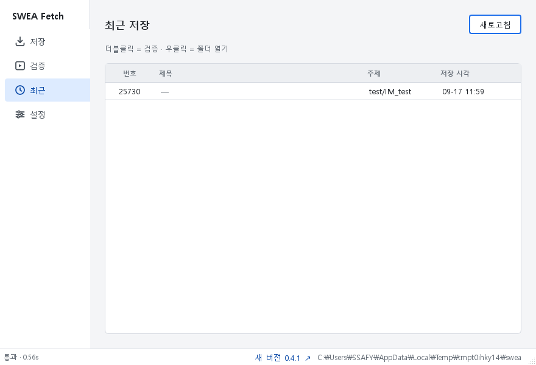

- exe: [Releases](https://github.com/yoon7270/swea_fetcher/releases/latest) 에서 새 exe 를 받아 **파일만 바꾸면** 됩니다. 설정·비밀번호·캐시는 그대로 유지됩니다.
- 소스: `git pull` 후 `pip install -e ".[gui]"`
- 끄기: 설정 페이지 체크박스 / `--no-update-check` / 환경변수 `SWEA_NO_UPDATE_CHECK=1`

변경 내역: [CHANGELOG.md](CHANGELOG.md)

---

## 문의·요청

**[GitHub Issues](https://github.com/yoon7270/swea_fetcher/issues/new/choose)** — *버그 신고* / *기능 요청* 템플릿 중 하나를 고르면 필요한 항목이 채워져 있습니다. 버그는 진단 정보와 재현 단계를, 요청은 "지금은 어떻게 하고 있는지"를 함께 적어 주세요.

---

<details>
<summary><b>개발자용</b> — 구조, 테스트, 사이트 구조 변경 대응, 빌드·Release</summary>

[docs/development.md](docs/development.md) 참고. 요약:

```powershell
pip install -e ".[dev,gui]"
```

```powershell
pytest
```

- 모듈 구조와 역할, 선택자 수정 위치(`swea_fetcher/parser.py` 상단 상수), 페이지 조사 기록([docs/swea-page-notes.md](docs/swea-page-notes.md))
- exe 빌드: `pyinstaller packaging\swea-fetch-gui.spec` → `dist\swea-fetch-gui.exe` (커밋하지 않음), 자가진단 `SWEA_FETCH_SELFTEST`
- 디자인 스펙 [design/design-spec.md](design/design-spec.md), 화면 캡처 [docs/gui-screenshots/](docs/gui-screenshots/)

</details>

## 라이선스

[MIT](LICENSE)

### 글꼴

GUI 는 [Pretendard](https://github.com/orioncactus/pretendard) (Regular · Bold, 원본 그대로) 를 앱에 포함해 사용합니다. Copyright (c) 2021 Kil Hyung-jin, [SIL Open Font License 1.1](https://scripts.sil.org/OFL) — 라이선스 전문은 `swea_fetcher/gui/theme/fonts/Pretendard-LICENSE.txt`. 글꼴 파일이 없으면 Malgun Gothic 으로 대신 표시됩니다.
